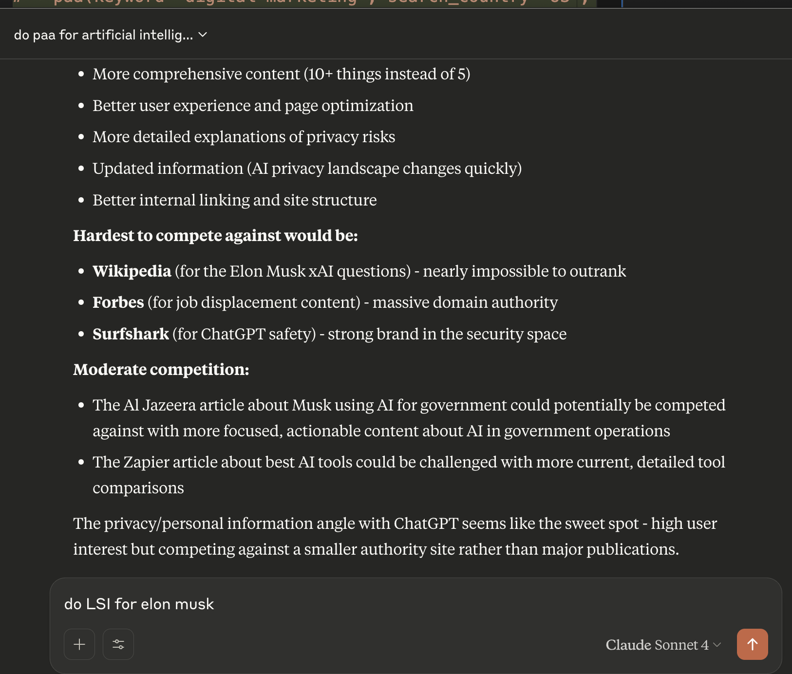

# kwrds.ai MCP Server



Model Context Protocol server for [kwrds.ai](https://www.kwrds.ai) keyword research and SEO tools. You can read more about the MCP protocol [in this blog post](https://www.kwrds.ai/blog/kwrds-ai-mcp).

## Setup

**Requires Python 3.11+**

1. **Get API key** from [kwrds.ai](https://www.kwrds.ai/api/documentation/API_Key_Setup)

2. **Install dependencies**:
   ```bash
   pip install -r requirements.txt
   ```

3. **Add to an MCP Client (Claude/Cursor/Chatgpt/etc.) Desktop config** (`~/Library/Application Support/Claude/claude_desktop_config.json`):
   ```json
   {
     "mcpServers": {
       "kwrds-ai": {
         "command": "python3",
         "args": ["/path/to/this/project/run_server.py"],
         "env": {
           "KWRDS_API_KEY": "your-api-key-here"
         }
       }
     }
   }
   ```
   
   **Replace `/path/to/this/project/` with your actual project path**

4. **Restart MCP Client**

## Usage

Ask your MCP Client:
- Find keywords for 'digital marketing' in the US
- Get People Also Ask questions for 'SEO tools'
- Generate an SEO outline for 'best laptops'
- Get best keywords for 'best laptops 2025'
- Get 7W1H for 'best AI tools'
- What does example.com rank for?

## Tools Available

- Keyword research with volumes & competition
- SERP analysis & ranking data
- People Also Ask questions
- AI content generation
- URL ranking analysis
- Usage statistics

## Support

Visit [kwrds.ai](https://www.kwrds.ai) for documentation, support, and more.
